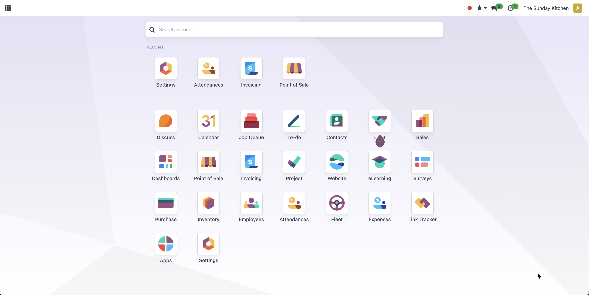
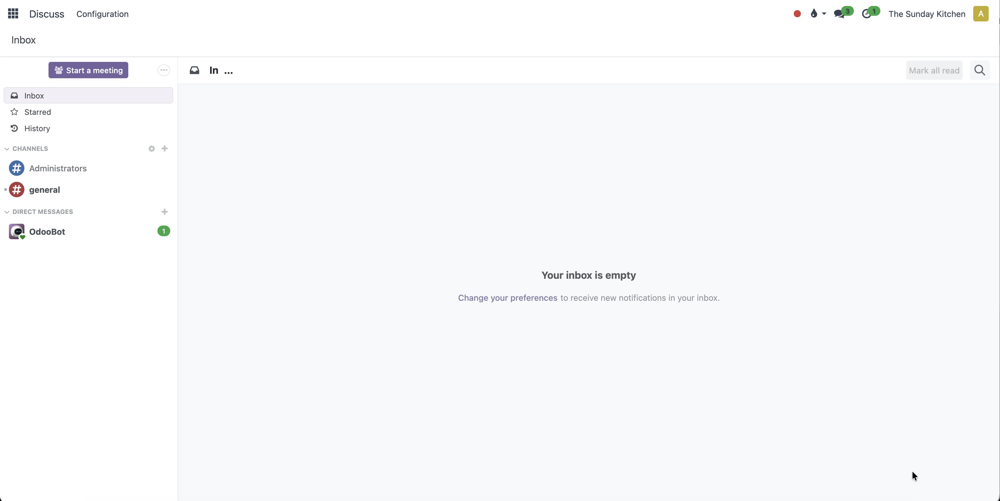
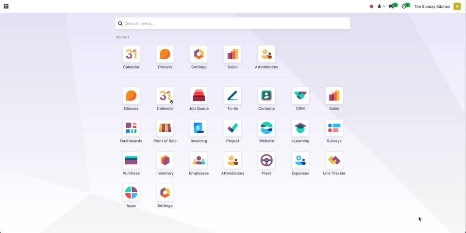

======================
Web Responsive Advance
======================

This module was born out of spite. Odoo 19 changed so many things that didn't need changing — and somewhere
in that frustration, a thought clicked: why not take Odoo 18 Community, and actually polish it
into something enterprise-grade? With my own preferences baked in, no compromises, starting with the UI.

What It Does
------------

Extends OCA's ``web_responsive`` with UI refinements, subtle animations, and personal touches
that make Odoo 18 Community feel like it belongs in a higher tier.

Key Improvements
----------------

* **Persistent Apps Menu State**
  The Apps Menu syncs with the URL hash (``#home``). Refresh mid-navigation and it stays
  exactly where you left it. Because losing your menu state on refresh is not a feature.

* **Recent Apps**
  Your last-used apps, always within reach. Less hunting, more doing.

* **Dark Mode Ready**
  Designed to play nicely with OCA's ``web_dark_mode``. Because dark mode shouldn't
  feel like an afterthought.

* **Color Scheme Rebranding**
  A fond farewell to Odoo's beloved purple. Both light and dark schemes are fully recolored —
  light goes crisp white with cool grey text (``#374151``), dark settles into a composed
  slate grey (``#2c3e50``). Professional without trying too hard.

* **Subtle Animations**
  Smooth animations on every page load, the app drawer, and more. The kind of polish
  that makes users think the whole thing was custom-built.

* **Improved Hover States**
  Navigation entries now respond with a gentle hover effect. Small touch, big difference.

Dependencies
~~~~~~~~~~~~

* `web_responsive <https://github.com/OCA/web/tree/18.0/web_responsive>`_ — OCA
* `web_dark_mode <https://github.com/OCA/web/tree/18.0/web_dark_mode>`_ — OCA (optional, for dark mode support)

Installation
------------

Install the module. It depends on ``web_responsive``. That's it.

Showcase
--------

|

|

|

Credits
-------

This module extends `OCA web_responsive <https://github.com/OCA/web/tree/18.0/web_responsive>`_,
originally authored by Tecnativa and the OCA contributors. All upstream code remains
under its original LGPL-3 license.

License
-------

This module is licensed under LGPL-3.0-or-later. See the ``LICENSE`` file for the
full license text.

Trademark Notice
----------------

"Odoo" is a trademark of Odoo S.A. This module is an independent community
extension and is not affiliated with, endorsed by, or sponsored by Odoo S.A.
